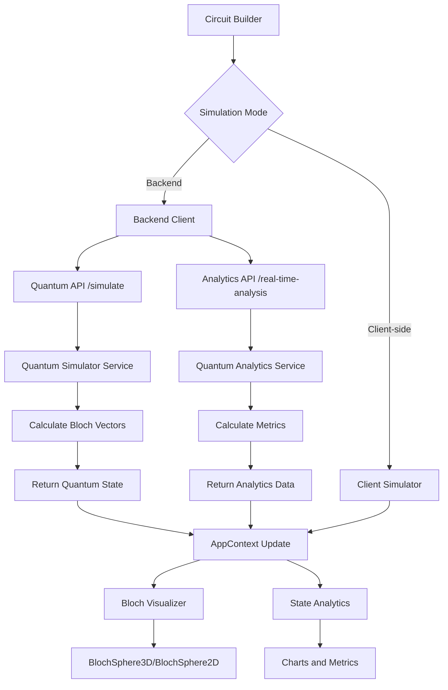

# Bloch Sphere and Analytics Backend Integration Design

## Overview

The current Bloch sphere visualization in QScope is not connected to the backend and provides static results for every circuit. This design document outlines the implementation plan to connect both the Bloch sphere visualization and analytics charts to the backend for dynamic, circuit-specific results.

The integration will leverage the existing backend quantum simulation service to calculate accurate Bloch vectors for each qubit in a circuit, and update the frontend visualization components to consume this data from the backend instead of using static values. Additionally, the 2D visualization and analytics charts will be enhanced to utilize the comprehensive analytics data already provided by the backend.

## Architecture

### Current Implementation
1. The frontend Bloch sphere components (`BlochSphere3D.jsx`, `BlochSphere2D.jsx`, `BlochVisualizer.jsx`) currently use static data or client-side simulation
2. The backend has a fully functional quantum simulator service (`quantum_simulator.py`) that can calculate Bloch vectors for all qubits
3. The backend exposes API endpoints (`quantum.py`) for circuit simulation including `/api/quantum/simulate` which returns Bloch vector data
4. The backend also provides comprehensive analytics through `/api/analytics/real-time-analysis`
5. The frontend has a backend client service (`backendClient.js`) that can communicate with the backend API

### Proposed Integration
1. Modify the frontend to use backend simulation mode by default for Bloch sphere visualization
2. Update the AppContext to fetch quantum state data from the backend when circuit changes
3. Ensure Bloch visualization components consume dynamic data from the quantum state in the AppContext
4. Enhance analytics components to utilize backend analytics data
5. Add error handling for backend communication failures

## Component Architecture

### Frontend Components
1. **BlochVisualizer** - Main visualization container component
2. **BlochSphere3D** - 3D visualization using Three.js
3. **BlochSphere2D** - 2D visualization with charts and graphs
4. **StateAnalytics** - Advanced analytics dashboard with charts
5. **AppContext** - State management with quantum state data

### Backend Services
1. **AdvancedQuantumSimulator** - Core simulation service that calculates Bloch vectors
2. **QuantumAnalytics** - Advanced analytics service for comprehensive metrics
3. **Quantum Routes** - API endpoints for circuit simulation and analytics
4. **Backend Client** - Frontend service for API communication

## Data Flow



## API Integration

### Current Backend Endpoints
The backend already provides the necessary data through multiple endpoints:

1. **Quantum Simulation Endpoint** - `/api/quantum/simulate` which returns:

```json
{
  "success": true,
  "result": {
    "qubits": [
      {
        "id": 0,
        "bloch": {
          "x": 0.0,
          "y": 0.0,
          "z": 1.0
        }
      }
    ],
    "entanglement": 0.0,
    "purity": 1.0,
    "fidelity": 1.0,
    "measurementProbabilities": [1.0, 0.0]
  }
}
```

2. **Analytics Endpoint** - `/api/analytics/real-time-analysis` which returns comprehensive metrics:

### Frontend Integration
The frontend will use the existing `backendClient.simulateCircuit()` method to fetch quantum state data and `backendClient.getRealTimeAnalysis()` method to fetch comprehensive analytics data, then update the AppContext with both.

## Implementation Plan

### Phase 1: Update AppContext Simulation Logic
1. Modify the `simulateCircuit` action in `AppContext.jsx` to default to backend simulation
2. Enhance the action to also fetch analytics data from the backend
3. Ensure the quantum state data structure matches what the Bloch components expect
4. Add proper error handling for backend communication failures

### Phase 2: Update Visualization Components
1. Ensure `BlochVisualizer.jsx` properly consumes quantum state data from AppContext
2. Verify `BlochSphere3D.jsx` and `BlochSphere2D.jsx` correctly render dynamic Bloch vectors
3. Update `StateAnalytics.jsx` to consume backend analytics data
4. Add loading states and error handling in visualization components

### Phase 3: Testing and Validation
1. Test with various circuit configurations to ensure accurate Bloch vector calculation
2. Verify analytics charts display correct data from backend
3. Verify performance with larger circuits (2-5 qubits)
4. Test fallback mechanisms when backend is unavailable

## Detailed Implementation

### 1. Update AppContext Simulation Logic

Modify the `simulateCircuit` action in `AppContext.jsx`:

```javascript
simulateCircuit: async () => {
  if (state.circuit.length === 0) {
    dispatch({ type: ActionTypes.SET_QUANTUM_STATE, payload: null })
    return
  }
  
  dispatch({ type: ActionTypes.SET_IS_SIMULATING, payload: true })
  dispatch({ type: ActionTypes.CLEAR_ERROR })
  
  try {
    let result
    
    // Default to backend simulation for accurate Bloch visualization
    console.log('Using backend simulation for Bloch sphere...')
    const circuitData = {
      gates: state.circuit.map(gate => ({
        gate: gate.gate,
        qubit: gate.qubit,
        position: gate.position,
        targetQubit: gate.targetQubit
      }))
    }
    
    try {
      const backendResult = await backendClient.simulateCircuit(circuitData)
      result = backendResult.result
      console.log('Backend simulation successful:', result)
    } catch (backendError) {
      console.warn('Backend simulation failed:', backendError.message)
      // Show error to user and potentially fall back
      throw backendError
    }
    
    dispatch({ type: ActionTypes.SET_QUANTUM_STATE, payload: result })
  } catch (error) {
    console.error('Simulation error:', error)
    
    // Create user-friendly error message
    const userError = {
      type: 'SIMULATION_ERROR',
      title: 'Simulation Failed',
      message: 'Unable to simulate the quantum circuit',
      suggestions: [
        'Try simplifying the circuit',
        'Check if all gates are properly placed',
        'Verify backend service is running'
      ],
      technicalDetails: error.message,
      timestamp: new Date().toISOString()
    }
    
    dispatch({ type: ActionTypes.SET_ERROR, payload: userError })
    dispatch({ type: ActionTypes.SET_QUANTUM_STATE, payload: null })
  }
  dispatch({ type: ActionTypes.SET_IS_SIMULATING, payload: false })
}
```

### 2. Update Bloch Visualization Components

Ensure `BlochVisualizer.jsx` correctly consumes the quantum state:

```javascript
// In BlochVisualizer.jsx
const blochVectors = useMemo(() => {
  if (!quantumState || !quantumState.qubits) return []
  
  return quantumState.qubits.map(qubit => ({
    x: qubit.bloch.x,
    y: qubit.bloch.y,
    z: qubit.bloch.z,
    id: qubit.id
  }))
}, [quantumState])
```

### 3. Update Analytics Components

Enhance `StateAnalytics.jsx` to consume backend analytics data:

```javascript
// In StateAnalytics.jsx
useEffect(() => {
  const analyzeCircuit = async () => {
    if (!circuit || circuit.length === 0 || !backendAvailable) {
      setDetailedAnalysis(null);
      setEducationalContent(null);
      return;
    }
    
    setLoading(true);
    try {
      const [analysis, education] = await Promise.all([
        backendClient.getRealTimeAnalysis({ gates: circuit }),
        backendClient.getEducationalContent({ gates: circuit }, 'intermediate')
      ]);
      
      if (analysis.success) {
        setDetailedAnalysis(analysis);
      }
      
      if (education.success || education.current_concepts) {
        setEducationalContent(education);
      }
    } catch (error) {
      console.warn('Backend analysis failed, using local analytics:', error.message);
      setDetailedAnalysis(null);
      setEducationalContent(null);
    } finally {
      setLoading(false);
    }
  };
  
  // Debounce the analysis
  const timeoutId = setTimeout(analyzeCircuit, 500);
  return () => clearTimeout(timeoutId);
}, [circuit, backendAvailable]);
```

### 3. Update Settings to Default to Backend Mode

Modify the initial settings in `AppContext.jsx`:

```javascript
settings: {
  autoSimulate: true,
  defaultQubits: 3,
  animationSpeed: 'normal',
  simulationMode: SimulationMode.BACKEND // Default to backend for accurate results
}
```

## Error Handling

### Backend Communication Failures
1. Display user-friendly error messages when backend is unreachable
2. Provide clear suggestions for resolving connection issues
3. Implement retry mechanisms for transient failures

### Data Validation
1. Validate Bloch vector data before rendering
2. Handle cases where backend returns unexpected data formats
3. Provide fallback visualizations for invalid data

## Performance Considerations

1. **Caching**: Utilize existing caching mechanisms in the backend simulator
2. **Debouncing**: Implement debouncing for rapid circuit changes to prevent excessive API calls
3. **Loading States**: Show loading indicators during simulation to improve UX
4. **Virtualization**: For circuits with many qubits, consider virtualization in the Bloch visualization

## Testing Strategy

### Unit Tests
1. Test AppContext simulation logic with mock backend responses
2. Verify Bloch visualization components render correctly with various Bloch vector inputs
3. Verify analytics components render correctly with backend metrics
4. Test error handling scenarios

### Integration Tests
1. Test end-to-end flow from circuit building to Bloch visualization
2. Test end-to-end flow from circuit building to analytics charts
3. Verify accurate Bloch vectors for known quantum states (|0⟩, |1⟩, |+⟩, |-⟩)
4. Verify accurate metrics in analytics dashboard
5. Test performance with various circuit complexities

### Manual Testing
1. Verify visualization accuracy for standard quantum circuits:
   - Single qubit in |0⟩ state (Bloch vector: (0, 0, 1))
   - Single qubit in |1⟩ state (Bloch vector: (0, 0, -1))
   - Single qubit in |+⟩ state (Bloch vector: (1, 0, 0))
   - Bell state (entangled qubits)
2. Verify analytics accuracy for standard quantum circuits:
   - Entanglement metrics for Bell state
   - Purity metrics for pure states
   - Probability distributions
3. Test visualization with 1-5 qubits
4. Test analytics with 1-5 qubits
5. Verify error handling when backend is unavailable

## Security Considerations

1. Ensure all API communications use HTTPS in production
2. Validate circuit data before sending to backend
3. Implement proper error handling to prevent information leakage
4. Follow existing CORS and authentication patterns in the backend

## Backward Compatibility

1. Maintain existing client-side simulation as fallback option
2. Preserve all existing component interfaces
3. Ensure localStorage settings migration if needed