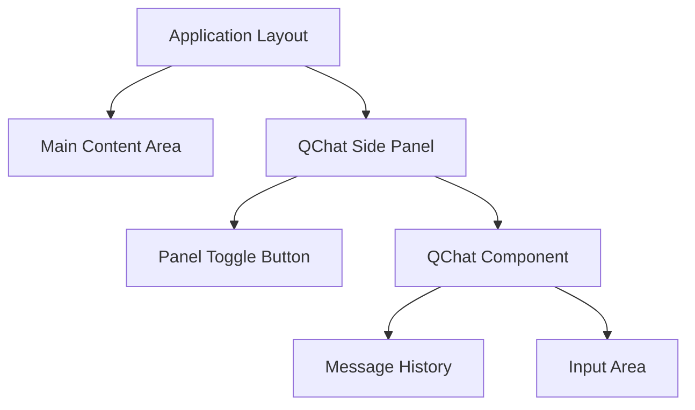
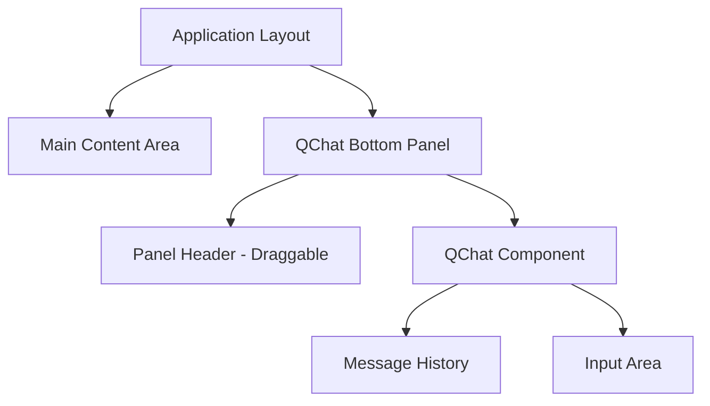

# QChat Window Layout and Placement Design

## Overview
This document addresses the issues with the current QChat window implementation, specifically the scrolling problems and layout concerns. It proposes several alternative layouts and placement options for the QChat component to improve user experience and integration with the QScope application.

## Current Issues
1. **Scrolling Problems**: The QChat window doesn't scroll properly, making it difficult for users to view conversation history
2. **Layout Issues**: The current layout of the QChat window is not visually appealing or well-integrated with the rest of the application
3. **Placement Concerns**: The modal-based placement may not be optimal for all use cases

## Analysis of Current Implementation

### QChat Component Structure
The current QChat component is implemented as a modal dialog that appears over the main application interface. Key structural elements include:

1. **Header Section**: Contains title and close button
2. **Message Display Area**: Shows conversation history between user and assistant
3. **Input Section**: Contains text input field, model selection dropdown, and send button
4. **Message Components**: Different rendering for user vs assistant messages, with special handling for circuit data

### Identified Issues
1. **Scrolling Container**: The message display area uses `overflow-y-auto` but may have sizing issues that prevent proper scrolling
2. **Height Constraints**: The fixed height of the modal may not provide enough space for conversations
3. **Layout Integration**: The modal approach interrupts user workflow and doesn't integrate well with the application's information architecture

## Proposed Solutions

### Solution 1: Side Panel Integration
Replace the modal with a collapsible side panel that can be toggled on/off.

#### Benefits:
- Maintains conversation context while allowing users to continue working
- Provides more vertical space for message history
- Better integration with the application's layout
- Persistent state without interrupting workflow

#### Implementation Details:


#### CSS/Structure Changes:
- Replace modal positioning with a fixed side panel
- Add transition animations for panel opening/closing
- Implement a toggle button in the main toolbar
- Adjust main content area width when panel is open

### Solution 2: Integrated Bottom Panel
Position QChat as a resizable bottom panel similar to developer console layouts.

#### Benefits:
- Familiar interaction pattern for developers
- Doesn't compete with main visualization space
- Resizable height for user preference
- Easy access without navigating away from current view

#### Implementation Details:


### Solution 3: Contextual Inline Placement
Integrate QChat directly into relevant sections of the application where quantum assistance is most needed.

#### Benefits:
- Context-aware assistance
- Reduces context switching
- More targeted help delivery
- Seamless integration with educational content

#### Potential Placement Locations:
1. **Educational Panel Integration**: Place QChat directly within the educational content area
2. **Circuit Builder Assistant**: Integrate as a helper within the circuit building workflow
3. **Analytics Panel**: Add QChat as an explanation assistant for quantum state analysis

## Recommended Approach

### Primary Recommendation: Side Panel Implementation
The side panel approach is recommended as the primary solution for the following reasons:

1. **Improved Workflow**: Users can maintain context while interacting with QChat
2. **Better Scrolling**: More vertical space allows for proper conversation history scrolling
3. **Visual Integration**: Cleaner integration with the existing application layout
4. **Persistent Access**: Always available without interrupting the main workflow

### Secondary Recommendation: Contextual Inline Placement
For specific use cases, implement contextual inline QChat components:
- When users click "Explain" on matrices in the educational panel
- As a helper within the circuit builder for gate explanations

## Detailed Side Panel Implementation Plan

### 1. Component Structure
```
App.jsx
├── Main Content (existing)
│   ├── Toolbar
│   ├── Circuit Builder
│   ├── Visualizations
│   └── Educational Content
└── QChatSidePanel (new)
    ├── Panel Header
    │   ├── Title
    │   ├── Toggle Button
    │   └── Close Button
    ├── QChat Component (modified)
    │   ├── Message History Area
    │   └── Input Area
    └── Panel Resizer (optional)
```

### 2. State Management
We'll need to manage the QChat panel state in the App component:

- `showQChatPanel`: Boolean to control panel visibility
- `qchatAutoQuery`: String for auto-generated queries
- Panel width state (optional for resizable feature)

### 3. Required Changes

#### App.jsx Modifications:
1. **State Management**:
   ```javascript
   const [showQChatPanel, setShowQChatPanel] = useState(false);
   const [qchatAutoQuery, setQchatAutoQuery] = useState(null);
   ```

2. **Layout Structure**:
   Replace the modal implementation with a side panel and add vertical toggle button:
   ```jsx
   <div className="flex relative">
     {/* Main Content */}
     <div className={`flex-1 transition-all duration-300 ${showQChatPanel ? 'mr-96' : ''}`}>
       {/* Existing content */}
     </div>
     
     {/* Vertical QChat Toggle Button */}
     <button
       onClick={() => setShowQChatPanel(!showQChatPanel)}
       className={`fixed right-0 top-1/2 transform -translate-y-1/2 z-30 flex items-center justify-center p-2 rounded-l-lg transition-all duration-300 ${showQChatPanel ? 'bg-indigo-600 text-white' : 'bg-slate-800 text-slate-300 hover:bg-slate-700'} border border-slate-700 border-r-0 shadow-lg`}
       title="Toggle QChat"
     >
       <Bot size={20} className="transform -rotate-90" />
       <span className="transform -rotate-90 whitespace-nowrap text-sm font-medium -ml-8 -mr-8">
         QChat
       </span>
     </button>
     
     {/* QChat Side Panel */}
     <QChatSidePanel 
       isOpen={showQChatPanel}
       onClose={() => setShowQChatPanel(false)}
       autoQuery={qchatAutoQuery}
     />
   </div>
   ```

3. **Remove QChat Button from Toolbar**:
   Since we're moving the QChat button to the side, we no longer need it in the toolbar. Remove the QChat button from the `toolbarButtons` array in `Toolbar.jsx`.

#### QChat.jsx Modifications:
1. **Remove Modal-Specific Code**:
   - Remove modal wrapper div
   - Remove fixed positioning
   - Remove close button (handled by panel header)

2. **Update Container Structure**:
   ```jsx
   <div className="flex flex-col h-full bg-slate-900/80 backdrop-blur-sm">
     <div className="flex-1 overflow-hidden flex flex-col">
       <div className="flex-1 overflow-y-auto p-4">
         {/* Messages with proper scrolling */}
         {messages.map((message) => (
           <div key={message.id} className="mb-4 last:mb-0">
             {renderMessage(message)}
           </div>
         ))}
         <div ref={messagesEndRef} />
       </div>
       <div className="p-4 border-t border-slate-700/50">
         {/* Input Area */}
       </div>
     </div>
   </div>
   ```

3. **Fix Scrolling Behavior**:
   Ensure the message container has proper height constraints:
   ```css
   .qchat-messages-container {
     flex: 1;
     overflow-y: auto;
     /* Ensure it takes available space */
   }
   ```

### 4. New Component: QChatSidePanel
Create a new wrapper component for the QChat side panel:

```jsx
const QChatSidePanel = ({ isOpen, onClose, autoQuery }) => {
  return (
    <div className={`fixed top-0 right-0 h-full w-96 bg-slate-900 border-l border-slate-700 transition-transform duration-300 transform ${isOpen ? 'translate-x-0' : 'translate-x-full'} z-40`}>
      <div className="flex flex-col h-full">
        {/* Panel Header */}
        <div className="p-4 border-b border-slate-700 flex justify-between items-center">
          <h2 className="text-lg font-semibold text-slate-200 flex items-center gap-2">
            <Bot className="text-indigo-400" size={20} />
            QChat - Quantum Assistant
          </h2>
          <button 
            onClick={onClose}
            className="text-slate-400 hover:text-white"
          >
            ✕
          </button>
        </div>
        
        {/* QChat Component */}
        <div className="flex-1 overflow-hidden">
          <QChat autoQuery={autoQuery} />
        </div>
      </div>
    </div>
  );
};
```

### 5. Vertical Toggle Button Implementation

#### Benefits of Vertical Button Approach:
1. **Consistent Placement**: The button is always visible and in the same location
2. **Better Visual Integration**: Matches the side panel opening direction
3. **Improved Accessibility**: Easier to discover and use
4. **Cleaner Toolbar**: Reduces clutter in the main toolbar

#### Implementation Details:
```jsx
// Vertical QChat Toggle Button
<button
  onClick={() => setShowQChatPanel(!showQChatPanel)}
  className={`fixed right-0 top-1/2 transform -translate-y-1/2 z-30 flex items-center justify-center p-2 rounded-l-lg transition-all duration-300 ${showQChatPanel ? 'bg-indigo-600 text-white' : 'bg-slate-800 text-slate-300 hover:bg-slate-700'} border border-slate-700 border-r-0 shadow-lg`}
  title="Toggle QChat"
>
  <Bot size={20} className="transform -rotate-90" />
  <span className="transform -rotate-90 whitespace-nowrap text-sm font-medium -ml-8 -mr-8">
    QChat
  </span>
</button>
```

#### Styling Features:
- **Positioning**: Fixed position on the right edge, vertically centered
- **Visual Feedback**: Color changes when panel is open
- **Icon Rotation**: Bot icon rotated -90 degrees for vertical orientation
- **Text Rotation**: "QChat" text rotated -90 degrees and properly spaced
- **Hover Effects**: Background color change on hover
- **Z-Index Management**: Proper layering above content but below panel

### 7. CSS Updates

#### Main Application Layout:
Update the main application container to accommodate the side panel:

```jsx
<div className="min-h-screen bg-gradient-to-br from-slate-950 via-indigo-950 to-purple-950 text-white flex">
  <div className={`flex-1 transition-all duration-300 ${showQChatPanel ? 'mr-96' : ''}`}>
    <Navigation />
    
    <div className="container mx-auto px-4 py-6 space-y-8">
      {/* Existing content */}
    </div>
  </div>
  
  {/* QChat Side Panel */}
  <QChatSidePanel 
    isOpen={showQChatPanel}
    onClose={() => setShowQChatPanel(false)}
    autoQuery={qchatAutoQuery}
  />
</div>
```

#### QChat Side Panel Styles:
```css
.qchat-side-panel {
  position: fixed;
  top: 0;
  right: 0;
  height: 100vh;
  width: 384px; /* 24rem */
  background: rgba(15, 23, 42, 0.95); /* slate-900 with opacity */
  backdrop-filter: blur(10px);
  border-left: 1px solid rgba(100, 116, 139, 0.3); /* slate-700 with opacity */
  z-index: 40;
  transform: translateX(100%);
  transition: transform 0.3s ease-in-out;
  display: flex;
  flex-direction: column;
}

.qchat-side-panel.open {
  transform: translateX(0);
}

.qchat-messages-container {
  flex: 1;
  overflow-y: auto;
  padding: 1rem;
  display: flex;
  flex-direction: column;
}
```

### 8. Implementation Steps

#### Step 1: Create the QChatSidePanel Component
Create a new file `src/components/QChatSidePanel.jsx`:

```jsx
import React from 'react';
import { Bot } from 'lucide-react';
import QChat from './QChat';

const QChatSidePanel = ({ isOpen, onClose, autoQuery }) => {
  return (
    <div className={`fixed top-0 right-0 h-full w-96 bg-slate-900 border-l border-slate-700 transition-transform duration-300 transform ${isOpen ? 'translate-x-0' : 'translate-x-full'} z-40`}>
      <div className="flex flex-col h-full">
        {/* Panel Header */}
        <div className="p-4 border-b border-slate-700 flex justify-between items-center">
          <h2 className="text-lg font-semibold text-slate-200 flex items-center gap-2">
            <Bot className="text-indigo-400" size={20} />
            QChat - Quantum Assistant
          </h2>
          <button 
            onClick={onClose}
            className="text-slate-400 hover:text-white"
          >
            ✕
          </button>
        </div>
        
        {/* QChat Component */}
        <div className="flex-1 overflow-hidden">
          <QChat autoQuery={autoQuery} />
        </div>
      </div>
    </div>
  );
};

export default QChatSidePanel;
```

#### Step 2: Update App.jsx
Modify `src/App.jsx` to use the side panel:

1. Import the new component:
```javascript
import QChatSidePanel from './components/QChatSidePanel';
```

2. Update state management:
```javascript
const [showQChatPanel, setShowQChatPanel] = useState(false);
const [qchatAutoQuery, setQchatAutoQuery] = useState(null);
```

3. Update the layout structure:
```jsx
return (
  <div className="min-h-screen bg-gradient-to-br from-slate-950 via-indigo-950 to-purple-950 text-white flex">
    <div className={`flex-1 transition-all duration-300 ${showQChatPanel ? 'mr-96' : ''}`}>
      <Navigation />
      
      <div className="container mx-auto px-4 py-6 space-y-8">
        {/* Toolbar with updated toggle function */}
        <Toolbar onToggleQChat={() => setShowQChatPanel(!showQChatPanel)} />
        
        {/* Rest of existing content */}
        {/* ... */}
      </div>
      
      {/* Keyboard Shortcuts and Error Notifications */}
      <KeyboardShortcutsHelp />
      <ErrorNotification />
    </div>
    
    {/* QChat Side Panel */}
    <QChatSidePanel 
      isOpen={showQChatPanel}
      onClose={() => setShowQChatPanel(false)}
      autoQuery={qchatAutoQuery}
    />
  </div>
);
```

4. Remove the old modal implementation:
```jsx
// Remove this entire section:
{showQChat && (
  <div className="fixed inset-0 bg-black/50 backdrop-blur-sm z-50 flex items-center justify-center p-4">
    <div className="bg-slate-900 rounded-xl w-full max-w-2xl max-h-[80vh] flex flex-col">
      <div className="p-4 border-b border-slate-700 flex justify-between items-center">
        <h2 className="text-xl font-bold text-slate-200">QChat - Quantum Assistant</h2>
        <button 
          onClick={() => setShowQChat(false)}
          className="text-slate-400 hover:text-white">
          ✕
        </button>
      </div>
      <div className="flex-1 min-h-0">
        <QChat autoQuery={qchatAutoQuery} />
      </div>
    </div>
  </div>
)}
```

#### Step 3: Update Toolbar.jsx
Remove the QChat button from the toolbar since we're implementing a vertical toggle button:

```javascript
// Remove the QChat button from the toolbarButtons array:
const toolbarButtons = [
  {
    icon: Undo2,
    label: 'Undo',
    action: actions.undo,
    disabled: !canUndo,
    shortcut: 'Ctrl+Z'
  },
  {
    icon: Redo2,
    label: 'Redo',
    action: actions.redo,
    disabled: !canRedo,
    shortcut: 'Ctrl+Y'
  },
  // QChat button removed from here
  {
    icon: Upload,
    label: 'Import',
    action: handleImport,
    disabled: false,
    shortcut: 'Ctrl+O'
  },
  {
    icon: Download,
    label: 'Export',
    action: handleExport,
    disabled: circuit.length === 0,
    shortcut: 'Ctrl+S'
  }
];
```

#### Step 4: Fix QChat.jsx Scrolling
Update the message container in `src/components/QChat.jsx`:

#### Step 5: Implement LLM Response Formatting
Add markdown rendering for properly formatted LLM responses:

1. Install required dependencies:
   ```bash
   npm install react-markdown remark-gfm
   ```

2. Update the QChat component to use markdown rendering:
   ```jsx
   // At the top of QChat.jsx
   import ReactMarkdown from 'react-markdown';
   import remarkGfm from 'remark-gfm';
   
   // In the renderMessage function, replace the plain text rendering:
   // Instead of:
   <div className="text-sm whitespace-pre-wrap">
     {message.content}
   </div>
   
   // Use:
   <div className="text-sm qchat-markdown">
     <ReactMarkdown remarkPlugins={[remarkGfm]}>
       {message.content}
     </ReactMarkdown>
   </div>
   ```

3. Add CSS styling for properly formatted markdown:
   ```css
   /* In your global CSS or component CSS */
   .qchat-markdown {
     /* Headers */
     h1, h2, h3, h4, h5, h6 {
       margin-top: 1rem;
       margin-bottom: 0.5rem;
       font-weight: 600;
     }
     
     /* Bold text */
     strong {
       font-weight: 600;
     }
     
     /* Code blocks */
     code {
       font-family: ui-monospace, SFMono-Regular, Menlo, Monaco, Consolas, "Liberation Mono", "Courier New", monospace;
       background-color: rgba(156, 163, 175, 0.2);
       padding: 0.2em 0.4em;
       border-radius: 0.25rem;
     }
     
     pre {
       background-color: rgba(31, 41, 55, 0.8);
       padding: 1rem;
       border-radius: 0.5rem;
       overflow-x: auto;
     }
     
     pre code {
       background-color: transparent;
       padding: 0;
     }
     
     /* Lists */
     ul, ol {
       margin-top: 0.5rem;
       margin-bottom: 0.5rem;
       padding-left: 1.5rem;
     }
     
     li {
       margin-bottom: 0.25rem;
     }
   }
   ```

```jsx
// Replace the current message container with:
<div className="flex-1 overflow-y-auto p-4">
  {messages.map((message) => (
    <div key={message.id} className="mb-4">
      {renderMessage(message)}
    </div>
  ))}
  
  {isLoading && (
    <div className="flex justify-start mb-4">
      <div className="flex items-start gap-2 max-w-[80%]">
        <div className="bg-slate-800 text-slate-100 rounded-2xl px-4 py-2">
          <div className="flex items-center gap-2 mb-1">
            <Bot size={16} className="text-indigo-400" />
            <span className="text-xs font-medium text-indigo-400">QChat</span>
          </div>
          <div className="flex space-x-1">
            <div className="w-2 h-2 bg-slate-400 rounded-full animate-bounce"></div>
            <div className="w-2 h-2 bg-slate-400 rounded-full animate-bounce" style={{ animationDelay: '0.2s' }}></div>
            <div className="w-2 h-2 bg-slate-400 rounded-full animate-bounce" style={{ animationDelay: '0.4s' }}></div>
          </div>
        </div>
      </div>
    </div>
  )}
  
  {error && (
    <div className="flex justify-start mb-4">
      <div className="flex items-start gap-2 max-w-[80%]">
        <div className="bg-red-900/30 text-red-200 rounded-2xl px-4 py-2 border border-red-700/50">
          <div className="flex items-center gap-2 mb-1">
            <AlertCircle size={16} />
            <span className="text-xs font-medium">Error</span>
          </div>
          <p className="text-sm">{error}</p>
        </div>
      </div>
    </div>
  )}
  
  <div ref={messagesEndRef} />
</div>
```

### 7. Scrolling Fix Implementation

#### Current Issues:
- Message container may not have proper height constraints
- Scroll behavior not triggered correctly

#### Fixes:
1. **Container Height Management**:
   ```css
   .qchat-messages-container {
     flex: 1;
     overflow-y: auto;
     max-height: calc(100vh - 200px); /* Adjust based on header/input height */
   }
   ```

2. **Scroll Position Management**:
   ```javascript
   // In QChat.jsx useEffect
   useEffect(() => {
     scrollToBottom();
   }, [messages]);
   
   const scrollToBottom = () => {
     messagesEndRef.current?.scrollIntoView({ behavior: "smooth" });
   };
   ```

3. **Message Container Structure**:
   ```jsx
   <div className="flex-1 overflow-y-auto p-4 flex flex-col">
     {messages.map((message) => (
       <div key={message.id} className="mb-4">
         {renderMessage(message)}
       </div>
     ))}
     <div ref={messagesEndRef} />
   </div>
   ```

## Alternative Placement Options

### 1. Bottom Panel Placement
Position QChat as a bottom panel similar to browser developer tools:

#### Advantages:
- Familiar interaction pattern
- Doesn't reduce main content width
- Easy to show/hide

#### Disadvantages:
- Competes with other bottom elements
- May reduce vertical space for main visualizations

### 2. Floating Window
Implement QChat as a draggable floating window:

#### Advantages:
- Flexible positioning
- Non-intrusive
- Can be moved out of the way

#### Disadvantages:
- More complex implementation
- May interfere with UI elements
- Less consistent user experience

### 3. Tabbed Interface Integration
Integrate QChat into a tabbed interface with other panels:

#### Advantages:
- Clean organization
- Consistent with existing UI patterns
- Saves screen space

#### Disadvantages:
- May hide the feature from users
- Requires switching context to access

## Implementation Priority

### Phase 1: Core Fixes (High Priority)
1. Fix scrolling issues in current QChat component
2. Improve layout and styling of message containers
3. Optimize message rendering for performance
4. Implement LLM response formatting

### Phase 2: Layout Enhancement (Medium Priority)
1. Implement side panel version of QChat
2. Add smooth transition animations
3. Implement vertical toggle button
4. Remove QChat button from toolbar

### Phase 3: Contextual Integration (Low Priority)
1. Add inline QChat components in educational panels
2. Implement context-aware triggers
3. Develop specialized UI for different contexts

## Vertical Toggle Button Benefits

The vertical toggle button approach provides several advantages over the traditional toolbar button:

1. **Consistent Placement**: Always visible in the same location regardless of scroll position
2. **Better Visual Flow**: Aligns with the side panel opening direction for a more cohesive experience
3. **Reduced Toolbar Clutter**: Frees up space in the main toolbar for other important tools
4. **Improved Discoverability**: More prominent and easier to find than a small toolbar icon
5. **Enhanced Accessibility**: Larger target area and clear labeling
6. **Visual Feedback**: Clear indication of panel state through color changes

## LLM Response Formatting

LLM responses from OpenRouter often contain markdown formatting characters that should be properly rendered instead of displayed as plain text. This includes:

1. **Bold Text**: `**bold text**` should render as **bold text**
2. **Headings**: `# Heading` should render as a proper heading
3. **Code Blocks**: ```code``` should render in a monospace font with proper background
4. **Lists**: `- item` should render as bullet points
5. **Line Breaks**: Proper handling of newlines

### Implementation Approach

To address this issue, we'll implement markdown parsing and rendering in the QChat component:

1. **Install a Markdown Rendering Library**:
   ```bash
   npm install react-markdown remark-gfm
   ```

2. **Update Message Rendering**:
   Replace plain text rendering with markdown rendering:
   ```jsx
   import ReactMarkdown from 'react-markdown';
   import remarkGfm from 'remark-gfm';
   
   // In the renderMessage function
   <ReactMarkdown remarkPlugins={[remarkGfm]} className="prose prose-invert max-w-none">
     {message.content}
   </ReactMarkdown>
   ```

3. **Custom Styling**:
   Add Tailwind CSS classes to properly style the rendered markdown:
   ```css
   .qchat-markdown {
     /* Headers */
     h1, h2, h3, h4, h5, h6 {
       margin-top: 1rem;
       margin-bottom: 0.5rem;
       font-weight: 600;
     }
     
     /* Bold text */
     strong {
       font-weight: 600;
     }
     
     /* Code blocks */
     code {
       font-family: ui-monospace, SFMono-Regular, Menlo, Monaco, Consolas, "Liberation Mono", "Courier New", monospace;
       background-color: rgba(156, 163, 175, 0.2);
       padding: 0.2em 0.4em;
       border-radius: 0.25rem;
     }
     
     pre {
       background-color: rgba(31, 41, 55, 0.8);
       padding: 1rem;
       border-radius: 0.5rem;
       overflow-x: auto;
     }
     
     pre code {
       background-color: transparent;
       padding: 0;
     }
     
     /* Lists */
     ul, ol {
       margin-top: 0.5rem;
       margin-bottom: 0.5rem;
       padding-left: 1.5rem;
     }
     
     li {
       margin-bottom: 0.25rem;
     }
   }
   ```

### Benefits

1. **Improved Readability**: Properly formatted responses are easier to read and understand
2. **Professional Appearance**: Well-formatted responses look more professional
3. **Better User Experience**: Users can quickly scan and understand information
4. **Code Presentation**: Quantum circuit code and explanations are displayed with proper formatting

## Testing and Validation

### Functionality Testing
1. **Scrolling Behavior**:
   - Verify that message history scrolls properly
   - Test with varying amounts of conversation content
   - Confirm auto-scroll to newest messages works

2. **Panel Toggling**:
   - Test opening and closing the panel
   - Verify keyboard shortcut still works
   - Check that panel state persists during interactions

3. **Responsive Design**:
   - Test panel behavior on different screen sizes
   - Verify content is readable on smaller screens
   - Confirm panel doesn't overlap critical UI elements

4. **LLM Response Formatting**:
   - Test markdown rendering for various formatting elements
   - Verify proper display of bold text, headings, and code blocks
   - Confirm lists and line breaks are rendered correctly
   - Check that mathematical notation is properly displayed

### User Experience Validation
1. **Performance**:
   - Measure load times for panel opening/closing
   - Verify smooth animations during transitions
   - Check for any lag during message rendering

2. **Usability**:
   - Confirm intuitive access to QChat functionality
   - Verify clear visual indication of active state
   - Test that users can easily return to main content
   - Validate that formatted responses improve readability

3. **Accessibility**:
   - Ensure keyboard navigation works properly
   - Verify sufficient color contrast for all elements
   - Confirm proper focus management
   - Check that screen readers can properly interpret formatted content

## Potential Challenges and Solutions

### 1. Responsive Design Issues
**Challenge**: The side panel may not work well on smaller screens
**Solution**: Implement responsive behavior that converts the side panel to a modal on mobile devices

### 2. Performance with Long Conversations
**Challenge**: Very long conversation histories may impact performance
**Solution**: Implement virtualized scrolling or pagination for message history

### 3. State Management Complexity
**Challenge**: Managing QChat state across different components
**Solution**: Use React Context or a state management library to centralize QChat state

### 4. Z-Index Conflicts
**Challenge**: The panel may conflict with other UI elements
**Solution**: Carefully manage z-index values and use proper stacking contexts

### 5. LLM Response Formatting
**Challenge**: LLM responses contain markdown formatting characters that are displayed as plain text
**Solution**: Implement markdown parsing and rendering for proper formatting of LLM responses

## Conclusion
The current QChat implementation has both functional (scrolling) and UX (placement) issues that impact user experience. The recommended side panel approach addresses both concerns by providing better scrolling capabilities and improved integration with the application workflow. This solution maintains the utility of the QChat feature while making it more accessible and less disruptive to the user's quantum exploration workflow.