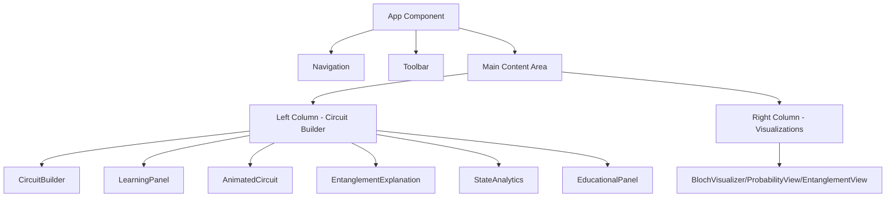
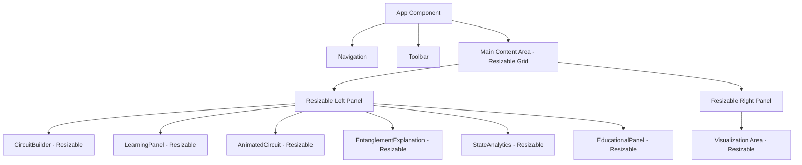

# Component Resizing and Layout Optimization Design

## Overview

This design document outlines the implementation plan for component resizing and layout optimization in the QScope quantum computing visualization platform. The solution addresses two main issues:

1. Components like State Analytics and Educational Content using only a small portion of available space
2. Layout issues in the Bloch Sphere 2D visualization where components overlap and go out of boundaries

The implementation will include:
- Proper sizing of components using CSS properties (width, height, flex, grid)
- Implementation of a manual adjustable resizer using the react-resizable library
- Restructuring of the Bloch Sphere 2D component to prevent overlapping and boundary issues

Based on the project requirements, we need to implement:
- CSS properties like width, height, flex, and grid to ensure proper layout distribution
- Manual adjustable resizer for all components using the react-resizable library
- Layout fixes for Bloch Sphere 2D to prevent overlapping and boundary issues with proper containment

## Architecture

### Current Layout Structure

The QScope application currently uses a grid-based layout in the main App component:



### Proposed Layout Structure

The new layout will implement resizable panels with proper containment:



## Component Resizing Implementation

### React-Resizable Integration

To implement manual adjustable resizing, we'll integrate the `react-resizable` library:

1. Install the library:
   ```bash
   npm install react-resizable
   npm install @types/react-resizable  # For TypeScript support
   ```

2. Import required components:
   ```jsx
   import { ResizableBox } from 'react-resizable';
   import 'react-resizable/css/styles.css';
   ```

3. Create a reusable ResizablePanel component:
   ```jsx
   import { ResizableBox } from 'react-resizable';
   
   export default function ResizablePanel({ 
     children, 
     width = 400, 
     height = 500, 
     minWidth = 300, 
     minHeight = 300,
     maxWidth = 1000,
     maxHeight = 1000,
     onResizeStop
   }) {
     return (
       <ResizableBox
         width={width}
         height={height}
         minConstraints={[minWidth, minHeight]}
         maxConstraints={[maxWidth, maxHeight]}
         resizeHandles={['se']}
         onResizeStop={onResizeStop}
         className="border border-slate-700 rounded-lg overflow-hidden"
       >
         <div className="w-full h-full overflow-auto">
           {children}
         </div>
       </ResizableBox>
     );
   }
   ```

### CSS-Based Resizing Strategy

For components that don't require manual resizing but need better space utilization:

1. **StateAnalytics Component**:
   - Increase default width from fixed to responsive percentages
   - Use flex-grow to utilize available space
   - Implement min/max width constraints
   - Current implementation uses a fixed layout that needs to be made responsive

2. **EducationalPanel Component**:
   - Apply responsive height with flex properties
   - Implement overflow handling for content
   - Adjust padding and margins for better space distribution
   - Current implementation has expandable sections that need to work within resizable containers

3. **CircuitBuilder Component**:
   - Reduce spacing between categorized gates (space-y-3 instead of larger gaps)
   - Optimize preset circuits layout from 4 columns to 2 columns
   - Based on requirements, change preset circuits layout from 4 columns to 2 columns to enhance space availability

4. **Main Grid Layout**:
   - Modify the main grid layout to adjust the ratio from 2:1 to 1:2
   - Reduce the gap for better space distribution
   - Current implementation uses `grid lg:grid-cols-3 gap-4` which needs adjustment

## Bloch Sphere 2D Layout Fix

### Current Issues

1. Components are stacked on top of each other
2. Some components extend beyond their boundaries
3. Lack of proper containment within parent components

### Solution Approach

1. **Individual Qubit Panels**:
   - Create separate panels for each qubit in the Bloch Visualizer
   - Implement proper labeling to distinguish which sphere belongs to which qubit
   - Use flexbox or grid with overflow hidden to ensure components stay within bounds
   - Based on requirements, implement individual panels for each qubit in the Bloch Visualizer component to improve visualization clarity

2. **CSS Containment**:
   - Apply `overflow: hidden` to parent containers
   - Use `position: relative` for proper child positioning
   - Implement proper z-index management to prevent overlapping
   - Ensure all components stay within bounds and are properly aligned

3. **Responsive Grid Layout**:
   ```jsx
   <div className="grid grid-cols-1 md:grid-cols-2 lg:grid-cols-3 gap-4">
     {blochVectors.map((vector, index) => (
       <div key={vector.id} className="bg-slate-800/50 rounded-lg p-4 border border-slate-700/50 overflow-hidden">
         <h3 className="text-sm font-semibold text-indigo-300 mb-3">Qubit {vector.id}</h3>
         {/* Visualization content */}
       </div>
     ))}
   </div>
   ```

4. **Current BlochSphere2D Issues**:
   - The component currently uses a grid layout but has overlapping issues
   - Components extend beyond their boundaries
   - Need to implement proper containment within parent components
   - The layout should use flexbox or grid with overflow hidden to ensure all components stay within bounds

## Detailed Implementation Plan

### Phase 1: Infrastructure Setup

1. Install react-resizable library
2. Create reusable ResizablePanel component
3. Define resizing constraints and handles

### Phase 2: Component Resizing Implementation

1. **StateAnalytics Component**:
   - Wrap with ResizableBox
   - Set appropriate min/max constraints
   - Preserve existing functionality

2. **EducationalPanel Component**:
   - Implement resizing with proper content handling
   - Maintain expandable sections functionality
   - Ensure matrix display optimization

3. **CircuitBuilder Component**:
   - Reduce spacing between gate categories
   - Optimize preset circuits layout
   - Implement resizable container

### Phase 3: Bloch Sphere 2D Fix

1. Restructure component layout with proper containment
2. Implement individual panels for each qubit
3. Add clear labeling for qubit identification
4. Apply flexbox/grid with overflow handling

### Phase 4: Main Layout Optimization

1. Modify main grid layout ratio from 2:1 to 1:2
   - Current implementation uses `grid lg:grid-cols-3 gap-4` with `lg:col-span-1` and `lg:col-span-2`
   - Change to `grid lg:grid-cols-3 gap-2` with `lg:col-span-2` and `lg:col-span-1` for better space distribution
   - Based on requirements, modify the main grid layout to adjust the ratio from 2:1 to 1:2 and reduce the gap

2. Reduce gap between columns for better space distribution
3. Implement responsive resizing for both columns

## API Endpoints Reference

No new API endpoints are required for this implementation. All changes are frontend-focused.

However, existing API endpoints used by the components will continue to function as before:
- Quantum Simulation API for StateAnalytics data
- Education Content API for EducationalPanel content
- Visualization APIs for Bloch Sphere data

## Data Models & State Management

### Resizable Component State

```javascript
const resizableState = {
  // Component dimensions
  dimensions: {
    stateAnalytics: { width: 400, height: 500 },
    educationalPanel: { width: 500, height: 600 },
    circuitBuilder: { width: 600, height: 700 }
  },
  
  // Resizing constraints
  constraints: {
    min: { width: 300, height: 300 },
    max: { width: 1000, height: 1000 }
  },
  
  // User preferences
  preferences: {
    isResizingEnabled: true,
    defaultSizes: {
      stateAnalytics: { width: 400, height: 500 },
      educationalPanel: { width: 500, height: 600 }
    }
  }
};
```

### AppContext Integration

The resizable state will be integrated with the existing AppContext:

```javascript
const AppContext = createContext({
  // ... existing state
  resizableState: {
    dimensions: {},
    constraints: {},
    preferences: {}
  },
  resizableActions: {
    updateDimensions: () => {},
    resetToDefaults: () => {},
    toggleResizing: () => {}
  }
});
```

### Component-Specific State

Each resizable component will maintain its own state for dimensions:

```jsx
// In StateAnalytics component
const [size, setSize] = useState({ 
  width: localStorage.getItem('stateAnalyticsWidth') || 500, 
  height: localStorage.getItem('stateAnalyticsHeight') || 600 
});

// In EducationalPanel component
const [size, setSize] = useState({ 
  width: localStorage.getItem('educationalPanelWidth') || 600, 
  height: localStorage.getItem('educationalPanelHeight') || 700 
});
```

## Business Logic Layer

### Resizing Logic

1. **Dimension Management**:
   - Store component dimensions in localStorage for persistence
   - Apply constraints to prevent unusable sizes
   - Handle responsive resizing for different screen sizes

2. **Constraint Validation**:
   - Ensure minimum usability dimensions
   - Prevent components from exceeding viewport boundaries
   - Maintain aspect ratios where appropriate

3. **User Preference Handling**:
   - Save user resizing preferences
   - Provide option to reset to default sizes
   - Enable/disable resizing functionality

### Layout Optimization Logic

1. **Space Distribution**:
   - Calculate optimal space allocation based on content
   - Dynamically adjust component sizes based on available space
   - Implement responsive behavior for different screen sizes

2. **Overlap Prevention**:
   - Use CSS containment properties to prevent overlapping
   - Implement proper z-index management
   - Apply overflow handling for content that exceeds boundaries

## Middleware & Interceptors

No new middleware or interceptors are required for this implementation.

## Testing Strategy

### Unit Tests

1. **Resizable Component Tests**:
   - Test dimension constraints enforcement
   - Verify localStorage persistence
   - Validate user preference handling
   - Test resize handle functionality

2. **Layout Component Tests**:
   - Test responsive behavior
   - Verify proper containment
   - Validate overlap prevention
   - Test boundary constraints

### Integration Tests

1. **Component Interaction Tests**:
   - Test resizing interactions between components
   - Verify layout adjustments when components are resized
   - Validate preservation of functionality during resizing
   - Test responsive layout changes

### UI Tests

1. **Visual Regression Tests**:
   - Test component appearance after resizing
   - Verify layout integrity across different screen sizes
   - Validate proper containment of all components
   - Test overflow handling in resized components

2. **User Experience Tests**:
   - Verify smooth resizing experience
   - Test accessibility of resize handles
   - Validate visual feedback during resizing

## Implementation Considerations

### Performance Optimization

1. **Resize Throttling**:
   - Implement throttling for resize events to prevent performance issues
   - Use requestAnimationFrame for smooth resizing experience
   - Debounce resize operations to prevent excessive re-renders

2. **Memory Management**:
   - Clean up event listeners when components unmount
   - Efficiently store and retrieve resizing preferences
   - Limit the number of resize events processed per second

### Accessibility

1. **Keyboard Navigation**:
   - Ensure resizable components are keyboard accessible
   - Provide keyboard shortcuts for resizing operations
   - Implement focus management for resize handles

2. **Screen Reader Support**:
   - Add appropriate ARIA labels for resizable components
   - Provide audio feedback for resizing actions
   - Ensure resize handles are properly announced

### Browser Compatibility

1. **CSS Support**:
   - Ensure flexbox and grid layouts work across supported browsers
   - Test resizing functionality on different browser engines
   - Verify CSS containment properties work correctly

2. **JavaScript Compatibility**:
   - Verify react-resizable library compatibility with target browsers
   - Test performance on lower-end devices
   - Ensure graceful degradation when resizing is not supported

### User Experience

1. **Visual Feedback**:
   - Provide clear visual indicators during resizing
   - Show dimension information while resizing
   - Implement smooth transitions for size changes

2. **Responsive Behavior**:
   - Ensure components resize appropriately on different screen sizes
   - Maintain usability on mobile devices
   - Preserve content readability at different sizes

## Conclusion

This design document outlines a comprehensive approach to implementing component resizing and layout optimization in the QScope application. By integrating the react-resizable library and applying CSS-based layout improvements, we will address the key issues of underutilized space in components and layout problems in the Bloch Sphere 2D visualization.

The implementation will provide users with the ability to manually adjust component sizes according to their preferences while ensuring proper containment and responsive behavior across different screen sizes. The solution maintains backward compatibility with existing functionality while significantly improving the user experience through better space utilization and visual organization.