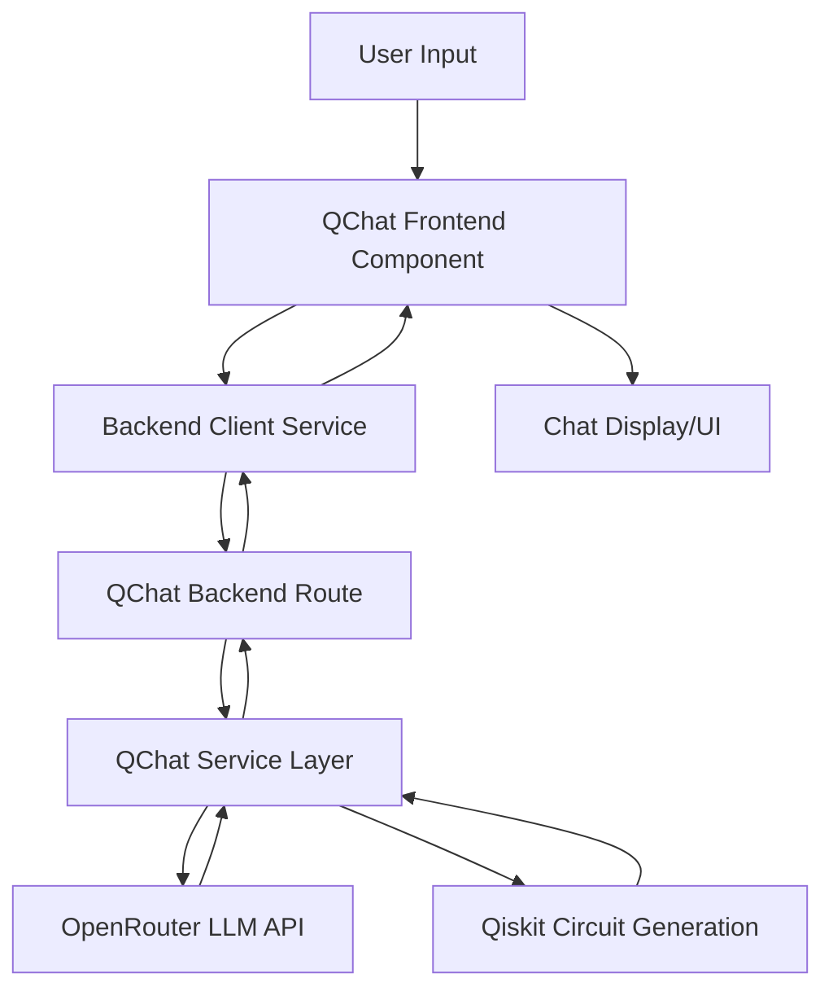

# QChat Feature Implementation Design

## 1. Overview

The QChat feature will provide users with an AI-powered chat interface to interact with quantum computing concepts. This feature will allow users to ask questions about quantum computing, generate quantum circuits from natural language descriptions, and receive educational content through a conversational interface.

### Key Features
- Natural language processing for quantum computing questions
- Quantum circuit generation from text descriptions
- Conversational interface with message history
- Integration with existing QScope educational content
- Real-time circuit visualization capabilities

### Technology Stack
- Frontend: React/Vite with Tailwind CSS
- Backend: Flask with Qiskit
- AI Integration: OpenRouter APIs for LLM access
- State Management: React Context API

## 2. Architecture

### System Components
1. **Frontend QChat Component** - User interface for chat interactions
2. **Backend QChat Route** - API endpoint for processing chat requests
3. **QChat Service Layer** - Business logic for LLM integration and circuit generation
4. **Backend Client Extension** - Frontend service for communicating with QChat API

### Data Flow


## 3. Frontend Component Architecture

### Component Structure
- **QChat Component** - Main container for chat functionality
- **MessageHistory Component** - Displays conversation history
- **MessageInput Component** - Input area for user questions
- **CircuitDisplay Component** - Renders generated quantum circuits
- **MessageBubble Component** - Individual message container with type-specific rendering

### State Management
The QChat component will manage its own local state for:
- Message history (array of message objects)
- Loading states (boolean for API requests)
- User input (current text in input field)
- Generated circuits (parsed circuit data for visualization)

Integration with AppContext for:
- Accessing global application state (current circuit, view mode)
- Updating main circuit when user selects a generated circuit
- Sharing educational content with LearningPanel

### UI/UX Design
- Responsive chat interface with message bubbles
- Loading indicators during API requests
- Circuit visualization within chat messages
- Copy functionality for generated QASM code
- Clear visual distinction between text and circuit responses
- Auto-scrolling message history
- Keyboard shortcuts for common actions
- Accessible form controls and ARIA labels

## 4. Backend Architecture

### API Endpoints
- `POST /api/qchat/query` - Main endpoint for processing chat requests
  - Accepts: JSON payload with user query and context
  - Returns: Formatted response with text and/or circuit data
  - Error Handling: Proper HTTP status codes and error messages

### Service Layer
- **QChatService** - Handles communication with OpenRouter API
  - Manages API key authentication
  - Processes natural language queries
  - Routes requests to appropriate handlers
- **CircuitGenerator** - Converts natural language to quantum circuits
  - Parses quantum computing terminology
  - Generates QASM code using Qiskit
  - Converts to QScope-compatible JSON format
- **ResponseFormatter** - Structures responses for frontend consumption
  - Formats text responses
  - Structures circuit data
  - Combines multiple response types

### Data Models
- **ChatMessage** - Represents individual messages in conversation
  - id: Unique identifier
  - content: Message content (text or circuit data)
  - type: "user", "assistant-text", or "assistant-circuit"
  - timestamp: Creation time
- **CircuitData** - Quantum circuit representation in multiple formats
  - qasm: OpenQASM formatted string
  - json: QScope-compatible JSON representation
  - metadata: Additional information about the circuit

## 5. Circuit Generation Capabilities

### Natural Language Processing
- Parse user queries to identify circuit generation requests
- Extract quantum gate operations and qubit specifications
- Handle common quantum computing terminology and concepts
- Recognize circuit patterns (e.g., Bell states, GHZ states, QFT)
- Interpret qubit counts and register specifications
- Understand measurement requirements

### Circuit Formats
- **QASM Output** - Standard quantum assembly format
  - Compatible with OpenQASM 2.0 specification
  - Includes proper register declarations
  - Contains all necessary gate operations
- **JSON Representation** - Compatible with existing QScope format
  - Matches structure used by CircuitBuilder component
  - Contains gate, qubit, and position information
  - Supports multi-qubit gates (CX, CZ, etc.)
- **Visual Representation** - Data structure for frontend rendering
  - Simplified format for UI components
  - Includes metadata for educational context

### Example Conversions
```
User: "Create a Bell state circuit"
→ 
QASM:
OPENQASM 2.0;
include "qelib1.inc";
qreg q[2];
creg c[2];
h q[0];
cx q[0],q[1];
measure q[0] -> c[0];
measure q[1] -> c[1];

JSON:
{
  "gates": [
    {"gate": "H", "qubit": 0, "position": 0},
    {"gate": "CX", "control": 0, "target": 1, "position": 1}
  ]
}

User: "Build a 3-qubit GHZ state with measurements"
→
QASM:
OPENQASM 2.0;
include "qelib1.inc";
qreg q[3];
creg c[3];
h q[0];
cx q[0],q[1];
cx q[1],q[2];
measure q[0] -> c[0];
measure q[1] -> c[1];
measure q[2] -> c[2];

JSON:
{
  "gates": [
    {"gate": "H", "qubit": 0, "position": 0},
    {"gate": "CX", "control": 0, "target": 1, "position": 1},
    {"gate": "CX", "control": 1, "target": 2, "position": 2}
  ]
}
```

## 6. Integration Points

### Navigation Integration
- Add QChat button to main toolbar using Lucide React icons
- Implement as a toggleable panel that slides in from the side
- Add keyboard shortcut (Ctrl+Shift+Q) for quick access
- Include in mobile-responsive navigation menu

### Backend Client Extension
- Add `queryQChat` method to backendClient service
  - Accept user query and optional context parameters
  - Handle QChat-specific error cases (API limits, parsing errors)
  - Implement proper request/response handling with timeouts
  - Add retry logic for transient failures
- Extend health check to include QChat service status

### Context Integration
- Access global application state through AppContext
  - Retrieve current circuit for contextual queries
  - Access user preferences for response customization
- Potentially update main circuit with generated circuits
  - Provide "Import to Builder" functionality for generated circuits
  - Enable seamless transition from chat to visual editing
- Share educational content with LearningPanel when available

## 7. Security Considerations

### API Key Management
- Store OpenRouter API key in environment variables
- Never expose API keys in frontend code
- Use backend as proxy for all LLM API calls
- Implement key rotation procedures
- Use separate keys for development and production

### Input Validation
- Sanitize all user inputs before processing
  - Remove potentially harmful characters
  - Limit input length to prevent abuse
- Validate generated circuit data before returning to frontend
  - Check QASM syntax validity
  - Verify JSON structure matches expected format
- Implement rate limiting to prevent API abuse
  - Per-user request limits
  - Burst protection for sudden traffic spikes

### CORS and Access Control
- Follow existing CORS configuration patterns in Flask
- Ensure proper authentication and authorization
  - Validate requests originate from authorized frontend
  - Implement CSRF protection
- Add request logging for security monitoring
- Implement input sanitization to prevent injection attacks

## 8. Technical Specifications

### Frontend Requirements
- Use React hooks for state management (`useState`, `useEffect`, `useContext`)
- Follow existing component structure and styling patterns
  - Use Tailwind CSS classes consistent with existing components
  - Implement dark mode support matching QScope theme
- Integrate with Lucide React icons for UI elements
- Implement responsive design with Tailwind CSS
  - Support mobile, tablet, and desktop views
  - Use flexbox and grid layouts
- Follow accessibility best practices
  - Proper ARIA attributes
  - Keyboard navigation support
  - Screen reader compatibility
- Implement error boundaries for graceful failure handling

### Backend Requirements
- Create new route file for QChat endpoints (`qscope-backend/app/routes/qchat.py`)
- Implement service layer for OpenRouter API integration
  - Use requests library with proper timeout handling
  - Implement retry logic with exponential backoff
- Handle QASM/JSON circuit generation and validation
  - Use Qiskit for circuit generation
  - Validate circuit structure before returning
- Follow existing error handling and logging patterns
  - Use Flask logging mechanisms
  - Return consistent error response formats
- Implement input validation and sanitization

### Environment Variables
- `OPENROUTER_API_KEY` - API key for OpenRouter
- `OPENROUTER_BASE_URL` - Base URL for OpenRouter API (default: https://openrouter.ai/api/v1)
- `QCHAT_RATE_LIMIT` - Maximum requests per user per minute (default: 10)
- `QCHAT_TIMEOUT` - API request timeout in seconds (default: 30)

## 9. Implementation Approach

### Phase 1: Backend Implementation
1. Create QChat route (`/api/qchat/query`) in `qscope-backend/app/routes/qchat.py`
2. Implement QChat service layer for OpenRouter integration in `qscope-backend/app/services/qchat_service.py`
3. Develop circuit generation capabilities using Qiskit in `qscope-backend/app/services/circuit_generator.py`
4. Create response formatting utilities in `qscope-backend/app/utils/qchat_formatter.py`
5. Add environment variable configuration in `qscope-backend/config.py`

### Phase 2: Frontend Implementation
1. Create QChat component with basic UI in `src/components/QChat.jsx`
2. Implement message history display with scrollable container
3. Add user input and submission functionality with validation
4. Integrate with backend API through extended backendClient service
5. Implement circuit visualization within chat using existing QScope components
6. Add loading states and error handling with user feedback

### Phase 3: Integration and Testing
1. Connect frontend to backend endpoints and test communication
2. Implement circuit visualization within chat using existing visualization components
3. Add loading states and comprehensive error handling
4. Conduct end-to-end testing with various query types
5. Validate circuit generation accuracy with Qiskit simulation
6. Test integration with existing AppContext state management

## 10. Testing Strategy

### Unit Testing
- Test QChat service layer functions
  - Mock OpenRouter API responses
  - Validate natural language parsing logic
  - Test circuit generation edge cases
- Validate circuit generation logic
  - Verify QASM output correctness
  - Check JSON format compatibility
  - Test multi-qubit gate generation
- Test response formatting utilities
  - Validate text response formatting
  - Check circuit data structure integrity
  - Test mixed response types

### Integration Testing
- Verify API endpoint functionality
  - Test valid query processing
  - Validate error response handling
  - Check rate limiting implementation
- Test frontend-backend communication
  - Verify request/response flow
  - Test loading state management
  - Validate error handling
- Validate circuit data format compatibility
  - Test QASM to JSON conversion
  - Verify circuit rendering in frontend
  - Check integration with CircuitBuilder

### User Experience Testing
- Verify chat interface usability
  - Test message history scrolling
  - Validate input field behavior
  - Check responsive design on all devices
- Test loading and error states
  - Verify loading indicators display correctly
  - Validate error message clarity
  - Test timeout handling
- Validate circuit visualization accuracy
  - Compare generated circuits with expected output
  - Test circuit import functionality
  - Verify educational content integration

## 11. Error Handling and Edge Cases

### Common Error Scenarios
- Invalid or malformed user queries
- OpenRouter API unavailability or errors
- Circuit generation failures
- Rate limiting exceeded
- Invalid circuit data from LLM

### Handling Strategies
- Graceful degradation for API failures
- Clear error messages for users
- Automatic retry for transient errors
- Fallback responses for parsing failures
- Circuit validation before frontend delivery

## 12. Performance Considerations

### Frontend Optimization
- Implement message virtualization for long chat histories
- Optimize circuit rendering components
- Use React.memo for performance-critical components
- Lazy load non-critical features

### Backend Optimization
- Cache frequent circuit generation requests
- Implement connection pooling for API requests
- Optimize Qiskit circuit generation
- Use asynchronous processing where appropriate

### Network Optimization
- Compress API responses
- Implement request batching
- Use efficient data serialization
- Minimize payload sizes