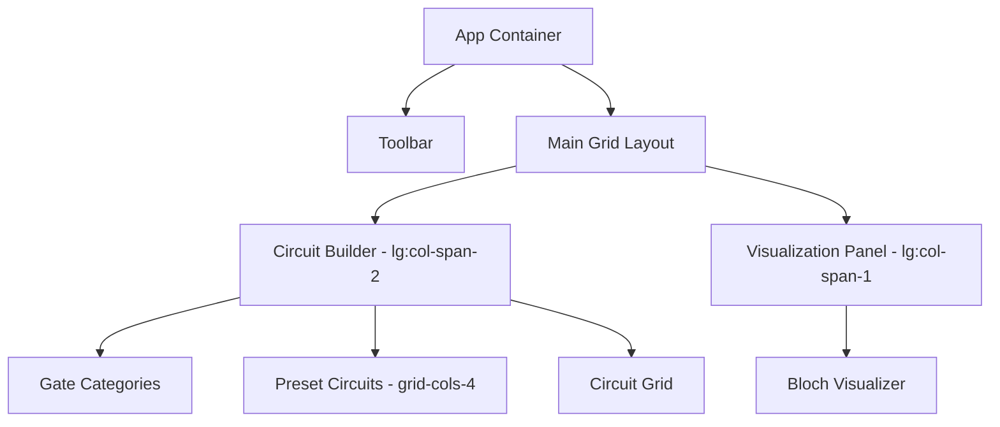
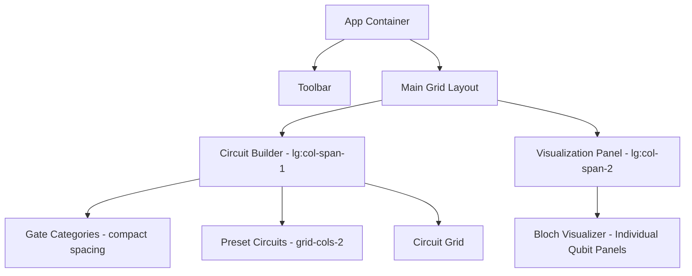

# QScope Circuit Builder Space Optimization and Bloch Sphere Visualization Enhancement

## Overview

This design document outlines improvements to optimize space usage in the QScope quantum computing educational platform. The primary focus is on reducing the space occupied by the circuit builder component while enhancing the Bloch sphere visualization with individual qubit panels. These changes will provide more screen real estate for the Bloch state visualizer panel and improve the user experience for quantum state visualization.

## Architecture

### Current Layout Structure

The current application layout uses a responsive grid system with a main content area and a visualization panel:



### Proposed Layout Structure

The proposed changes will optimize the layout by:
1. Reducing spacing between categorized gates
2. Using a two-column layout for quick start templates
3. Implementing individual panels for each qubit's Bloch sphere



## Component Architecture

### Circuit Builder Optimization

#### Gate Categories Section
- **Current Implementation**: Gate categories with significant vertical spacing
- **Optimization**: Reduce vertical spacing between categories by 30-40%
- **Implementation**:
  ```jsx
  // Current spacing
  <div className="space-y-6">
  
  // Optimized spacing
  <div className="space-y-3">
  ```

#### Preset Circuits Section
- **Current Implementation**: Four-column grid layout for quick start templates
- **Optimization**: Two-column grid layout to reduce width footprint
- **Implementation**:
  ```jsx
  // Current layout
  <div className="grid grid-cols-2 md:grid-cols-4 gap-3">
  
  // Optimized layout
  <div className="grid grid-cols-2 gap-3">
  ```

#### Overall Circuit Builder Container
- **Current Implementation**: Full-width component in a 2:1 grid ratio
- **Optimization**: Reduce to 1:2 grid ratio to give more space to visualization
- **Implementation**:
  ```jsx
  // App.jsx - Current grid
  <div className="grid lg:grid-cols-3 gap-6">
  
  // App.jsx - Optimized grid
  <div className="grid lg:grid-cols-3 gap-4">
  ```

### Bloch Sphere Visualization Enhancement

#### Individual Qubit Panels
- **Current Implementation**: Single visualization container showing all Bloch spheres
- **Optimization**: Individual panels for each qubit with clear labeling
- **Implementation**:
  ```jsx
  // BlochVisualizer.jsx - Individual panels for each qubit
  <div className="space-y-4">
    {blochVectors.map((vector, index) => (
      <div key={vector.id} className="bg-slate-800/50 rounded-lg p-4 border border-slate-700/50">
        <h3 className="text-sm font-semibold text-indigo-300 mb-3">Qubit {vector.id}</h3>
        {/* Individual Bloch sphere visualization for this qubit */}
      </div>
    ))}
  </div>
  ```

#### 3D Visualization Improvements
- **Current Implementation**: Single 3D canvas with multiple spheres
- **Optimization**: Individual 3D canvases for each qubit with optimized rendering
- **Implementation**:
  ```jsx
  // BlochSphere3D.jsx - Individual rendering for each qubit
  {vectors.map((vector) => (
    <div key={vector.id} className="h-80">
      <Canvas>
        <Scene vector={vector} />
      </Canvas>
    </div>
  ))}
  ```

#### 2D Visualization Improvements
- **Current Implementation**: Grid layout for multiple qubits
- **Optimization**: Consistent individual panel approach with better labeling
- **Implementation**:
  ```jsx
  // BlochSphere2D.jsx - Individual panels with clear qubit identification
  {chartData.map((data, index) => (
    <div 
      key={index} 
      className="bg-slate-800/50 p-4 rounded-lg border border-slate-700"
      style={{ borderColor: data.color }}
    >
      <h5 className="text-sm font-medium mb-3" style={{ color: data.color }}>
        Qubit {data.name}
      </h5>
      {/* Visualization components */}
    </div>
  ))}
  ```

## Data Flow Between Layers

### Frontend State Management
- **Current Flow**: AppContext provides quantum state to BlochVisualizer
- **Optimized Flow**: Maintain same data flow but with enhanced individual qubit handling
- **Implementation**:
  ```mermaid
  graph LR
    A[AppContext] --> B[Quantum State Data]
    B --> C[BlochVisualizer Component]
    C --> D[Individual Qubit Panels]
    D --> E[BlochSphere3D/BlochSphere2D]
  ```

### Backend Integration
- **Current Integration**: Single API call for all qubit data
- **Optimized Integration**: Maintain same backend calls but with improved frontend rendering
- **Data Structure**:
  ```javascript
  // Current data structure
  quantumState = {
    qubits: [
      { id: 0, bloch: { x: 0.5, y: 0.3, z: 0.8 } },
      { id: 1, bloch: { x: -0.2, y: 0.9, z: 0.1 } }
    ]
  }
  
  // Maintained in optimized version with individual panel rendering
  ```

## Implementation Plan

### Phase 1: Circuit Builder Optimization
1. **Reduce Gate Category Spacing**
   - Modify `CircuitBuilder.jsx` to reduce vertical spacing
   - Update CSS classes from `space-y-6` to `space-y-3`
   - Adjust padding and margins for gate buttons

2. **Optimize Preset Circuits Layout**
   - Change grid layout from 4 columns to 2 columns
   - Adjust button sizes to maintain usability
   - Update responsive breakpoints for different screen sizes

3. **Adjust Main Grid Layout**
   - Modify `App.jsx` grid ratio from 2:1 to 1:2
   - Reduce gap between columns from `gap-6` to `gap-4`
   - Ensure responsive behavior on smaller screens

### Phase 2: Bloch Visualization Enhancement
1. **Individual Qubit Panel Implementation**
   - Modify `BlochVisualizer.jsx` to render individual panels
   - Add clear labeling for each qubit
   - Implement consistent styling across all visualization modes

2. **3D Visualization Optimization**
   - Update `BlochSphere3D.jsx` to support individual rendering
   - Optimize performance for multiple canvases
   - Maintain existing performance monitoring features

3. **2D Visualization Enhancement**
   - Improve `BlochSphere2D.jsx` with individual panels
   - Enhance labeling and color coding for each qubit
   - Maintain all existing chart types with improved layout

### Phase 3: Testing and Refinement
1. **Responsive Design Testing**
   - Verify layout on different screen sizes
   - Test behavior on mobile and tablet devices
   - Adjust breakpoints as needed

2. **Performance Testing**
   - Monitor rendering performance with individual panels
   - Optimize for systems with limited resources
   - Validate WebGL performance with multiple canvases

3. **User Experience Validation**
   - Verify improved space utilization
   - Confirm enhanced visualization clarity
   - Gather feedback on individual qubit panels

## Technology Stack

### Frontend Technologies
- **React**: Component-based architecture
- **Tailwind CSS**: Utility-first styling
- **Three.js**: 3D visualization rendering
- **Framer Motion**: Animation and transitions
- **Recharts**: 2D data visualization

### Backend Technologies
- **Flask**: Web framework for API endpoints
- **Qiskit**: Quantum computing simulation
- **NumPy/SciPy**: Mathematical computations

## Testing Strategy

### Unit Testing
1. **Component Rendering Tests**
   - Verify individual qubit panel rendering
   - Test layout changes in CircuitBuilder component
   - Validate responsive behavior

2. **Data Flow Tests**
   - Confirm quantum state data properly distributed to individual panels
   - Validate Bloch vector calculations for each qubit
   - Test error handling in visualization components

### Integration Testing
1. **Layout Integration Tests**
   - Verify space optimization achieves intended results
   - Test interaction between CircuitBuilder and visualization panels
   - Validate responsive grid behavior

2. **Visualization Integration Tests**
   - Confirm individual qubit panels display correct data
   - Test 3D and 2D visualization modes
   - Validate performance with multiple qubits

### User Experience Testing
1. **Usability Testing**
   - Evaluate ease of circuit building with optimized layout
   - Assess clarity of individual qubit visualizations
   - Gather feedback on space utilization improvements

2. **Performance Testing**
   - Measure rendering performance with individual panels
   - Test on various hardware configurations
   - Validate optimization effectiveness